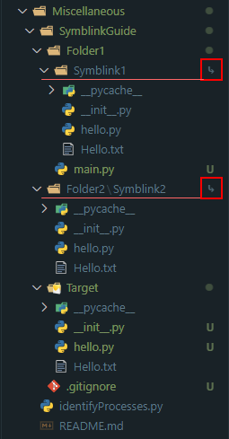

## Symblics
Symblics are extremely useful in many occasions
Suppose you want common modules folder in the root directory to be referenced by multiple projectBased Folders inside the a single repository.

It is similar to .gitsubmodule but it works within a repository instead of fetching updates from a separate repository.

### Windows CMD
Step 1: Create 'Target' Folder in the Root\
Inside Root: `mkdir Target`\
Step 2: Go into the folder (Here 'Folder1')where symblink has to be setup which would reference target folder\
`cd Folder1`\
Step 3: `mklink /D "SymblinkName/Path" "TargetPath"`
Use relative paths so that the same can be reflected on other machine when repo is cloned\
`mklink /D "Symblink1" "..\Target"`

\
When link is created a arrow would be represented in front of the folder hightlighting it as Symblink. Also see which files are automatically considered for tracking.

> When creating files inside the target folder. 
> git automatically ignores the files which are virtually available inside symblinks and only tracks the ones in the target

> We can see that only target files are being staged and symblink files are not shown as `leftovers` and are not being shown as `untracked` in outliner.
> Added the actual commit reference so you can browse the repo at this history.
> https://github.com/AgastyaPatel/SymblinkGuide/commit/e5498d2848d657f32a75feb59541dcb7d6490abd

### Clone Configuration
Set the symblinks to True
`git config --global core.symlinks true`\
Now, Cloning the repo would have the symblink on by default and git would set them up for you automatically.

